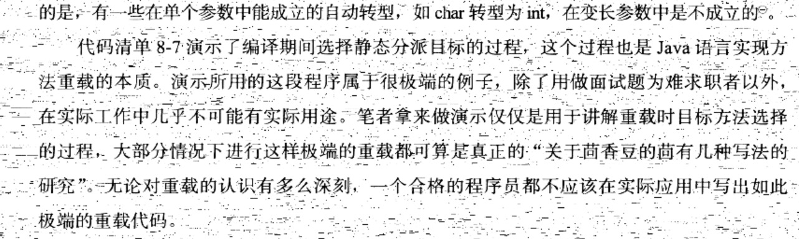

类初始化
===

# [与static的纠缠](http://wiki.jikexueyuan.com/project/java-vm/class-initialization.html)


# 静态分派

所有依赖静态类型来定位方法执行版本的分派称之为静态分派

```
public class StaticDispatch {
    static abstract class Human{

    }


    static class Man extends Human{

    }

    static class Woman extends Human{

    }

    public void sayHello(Human guy){
        System.out.println("hello, guy");
    }

    public void sayHello(Man guy){
        System.out.println("hello, man");
    }

    public void sayHello(Woman guy){
        System.out.println("hello, woman");
    }


    public static void main(String[] args){
        Human man = new Man();
        Human woman = new Woman();

        StaticDispatch sr = new StaticDispatch();
        sr.sayHello(man);
        sr.sayHello(woman);
    }
}

```


以 Human man = new Man() 为例，Human称之为变量的静态类型，后面的Man 称之为变量的实际类型。区别是：

 * 静态类型的变化发生在编译时期
 * 实际类型的变化发送在运行时

**编译器在编译时期不知道变量的实际类型是什么**

```
//实际类型变化
Human man = new Man();
man = new Woman();

//静态类型变化
sr.sayHello((Man)man);
sr.sayHello((Woman)man);
```

代码中刻意定义了两个静态类型相同但实际类型不同的变量，但编译器在**重载时是通过参数的静态类型作为判断依据的**，因为静态类型在编译时期可知





# 动态分派

```
public class DynamicDispatch {
    static abstract class Human{
        protected abstract void sayHello();
    }


    static class Man extends Human{

        @Override
        protected void sayHello() {
            System.out.println("hello, man");
        }
    }

    static class Woman extends Human{

        @Override
        protected void sayHello() {
            System.out.println("hello, woman");
        }
    }


    public static void main(String[] args) {
        Human man = new Man();
        Human woman = new Woman();

        man.sayHello();
        woman.sayHello();

        man = new Woman();
        man.sayHello();
    }
}

```


显然这里不能再根据静态类型判断了，因为man和woman的静态类型都是human而且在执行sayHello时发生了不同的行为，原因在于两个变量的实际类型不一样。

在机器指令中：

* 首先创建这两个对象引用
* 然后把引用压到栈顶，他们是sayHello的所有者也称之为 接受者
* 之后invokevirtual进行解析：
	* 找到栈顶元素锁指向对象的实际类型，记作C
	* 如果C中找到了相符合的方法则进行权限校验(public,private)
	* 否则，向父类寻找
	* 如果还没找到，throw AbstractMethodError 异常

**由于invokevirtual指令执行的第一步就是在运行期确切的接受者的实际类型，所以两次调用的invokevirtual指令把常量池中的类方法符号引用解析到了不同的直接引用上，这个过程是java方法重写的本质。**我们把这种在运行期根据实际类型确定方法执行版本的分派过程称之为动态分派。


